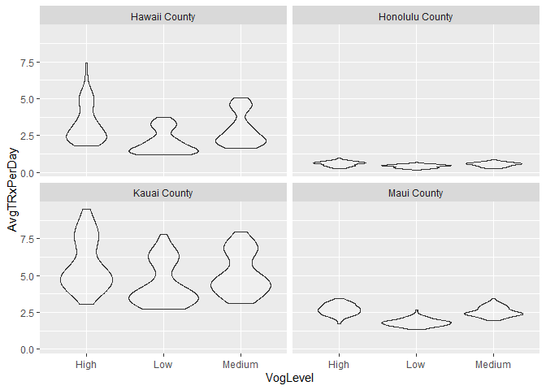

## Load Libraries


```r
library(tidyverse)
library(readxl)
```


## Read in Data


```r
data <- read_csv("../../Data/Hawaii Volcano Study_Final 05.18.2021.csv")
```

## EDA

The dates of interest, as defined by Diana Felton are as follows:

May - Aug 2017 – __MEDIUM Vog__

May – Aug 2018 – __HIGH Vog__

May – Aug 2019 – __LOW Vog__

Here we will filter the data to include only the dates of interest, rename a few columns to make them easier to use, and add an attribute that classifies each of the 3 time frames as their respective level of VOG.


```r
interested_data <- data %>% 
  filter(Month == "05" | Month == "06" | Month == "07" | Month == "08") %>% 
  rename(prod_name = `Product Name`,
         date = `Year-Month-Week`,
         location = `Zip/Territory`) %>% 
  mutate(VogLevel = case_when(
    Year == 2017 ~ "Medium",
    Year == 2018 ~ "High",
    Year == 2019 ~ "Low"
  )) %>% 
  filter(Class == "ANTIASTHMATIC and BRONCHODILATOR AGENTS") %>% 
  mutate(CountyPop = case_when(
    County == "Hawaii County" ~ 203340,
    County == "Honolulu County" ~ 963826,
    County == "Kauai County" ~ 71851,
    County == "Maui County" ~ 167989
  ),
  trx_per_hundred_thousand = (TRx / CountyPop)*100000
  )
```

Below is a bit of exploratory data analysis (EDA) regarding the attribute of interest, including a 5-number-summary of the TRx variable, the number of transactions that were above 100 prescriptions, and a plot showing the number of prescriptions for each transaction during each of the time periods, throughout each month, and in each county.


```r
table(interested_data$Class)
```

```
## 
## ANTIASTHMATIC and BRONCHODILATOR AGENTS 
##                                   97939
```

```r
summary(interested_data$TRx)
```

```
##    Min. 1st Qu.  Median    Mean 3rd Qu.    Max. 
##   1.000   1.000   2.000   4.833   4.000 531.000
```

```r
interested_data %>% filter(TRx > 100) %>% nrow()
```

```
## [1] 186
```

```r
ggplot(interested_data, aes(x = Month, y = TRx))+
  geom_jitter(height = 0, alpha = .2, aes(col = as.factor(VogLevel)))+
  theme(panel.grid.minor = element_blank(),
        panel.grid.major.x = element_blank())+
  facet_wrap(~County)+
  labs(y = "Number of Prescriptions",
       col = "Level of VOG",
       title = "# of TRx per Transaction")
```

<!-- -->

```r
#, scales = "free"


#Control for pop using census data and fixed axis
#Look at Hawaii county by location specifically
#Heatmap of Hawaii County
#Stats tests
#Boxplots
```


```r
ggplot(interested_data, aes(x = VogLevel, y = TRx))+
  geom_violin()+
  facet_wrap(~County)+
labs(x = "Level of VOG",
     y = "Number of Prescriptions",
     title = "Monthly Violin-Plots per County")
```

<!-- -->


```r
hidf <- interested_data %>% 
  filter(County == "Hawaii County") %>% 
  select(location) 
unique(hidf$location)
```

```
## [1] "96740"            "Hawaii County NW" "Hawaii County SE" "96720"
```

```r
hodf <- interested_data %>% 
  filter(County == "Honolulu County") %>% 
  select(location) 
unique(hodf$location)
```

```
##  [1] "96814"                         "96782"                        
##  [3] "Honolulu County Pearl Harbor"  "96701"                        
##  [5] "Honolulu County N"             "Windward"                     
##  [7] "96792"                         "96706"                        
##  [9] "Honolulu County Central"       "96813"                        
## [11] "96707"                         "Honolulu County East Honolulu"
## [13] "96744"                         "96817"                        
## [15] "96826"                         "96797"                        
## [17] "Diamond Head"
```

```r
kidf <- interested_data %>% 
  filter(County == "Kauai County") %>% 
  select(location) 
unique(kidf$location)
```

```
## [1] "Kauai County N" "96766"          "Kauai County S"
```

```r
midf <- interested_data %>% 
  filter(County == "Maui County") %>% 
  select(location) 
unique(midf$location)
```

```
## [1] "Maui Central"  "96732"         "Maui County W" "96793"
```

```r
library(lubridate)
HawaiiCounty <- c("96740","Hawaii County NW","Hawaii County SE", "96720")
HonoluluCounty <- c("96814", "96782", "Honolulu County Pearl Harbor","96701", "Honolulu County N", "Windward", "96792","96706", "Honolulu County Central", "96813","96707","Honolulu County East Honolulu","96744","96817", "96826","96797","Diamond Head")
KauaiCounty <- c("Kauai County N","96766","Kauai County S")
MauiCounty <- c("Maui Central","96732","Maui County W", "96793")

correct_data <- interested_data %>% 
  group_by(date, location) %>% 
  summarise(AvgTRxPerDay = mean(trx_per_hundred_thousand)) %>% 
  mutate(County = case_when(
    location %in% HawaiiCounty ~ "Hawaii County",
    location %in% HonoluluCounty ~ "Honolulu County",
    location %in% KauaiCounty ~ "Kauai County",
    location %in% MauiCounty ~ "Maui County"
  ),
  Year = year(ymd(date)),
  VogLevel = case_when(
    Year == 2017 ~ "Medium",
    Year == 2018 ~ "High",
    Year == 2019 ~ "Low"
  ),
  Month = month(ymd(date))
  ) 
```

## Simple ANOVA

### Hypotheses 

The hypotheses for the following ANOVA (Analysis of Variance) test are as follows:


$$
H_o: \mu_{\text{Low VOG}} \neq \mu_{\text{Medium VOG}} \neq \mu_{\text{High VOG}} = \mu
$$

$$
H_a: \mu_i  \neq \mu \text{ For at least one } i
$$

The level of significance for this test will be set to $\alpha = 0.05$


```r
simple_aov <- aov(AvgTRxPerDay ~ VogLevel, data = correct_data)
summary(simple_aov)
```

```
##               Df Sum Sq Mean Sq F value   Pr(>F)    
## VogLevel       2     82   41.15   14.81 4.26e-07 ***
## Residuals   1481   4114    2.78                     
## ---
## Signif. codes:  0 '***' 0.001 '**' 0.01 '*' 0.05 '.' 0.1 ' ' 1
```

As the p-value for this test is significant, we reject our null hypothesis and conclude that there is a significantly different effect on the average number of prescriptions administered in each 'location' at times of low, medium, and high VOG. 

ANOVA is somewhat limiting in it's statistical conclusivity in that we can only conclude that "at least one of the 3 groups statistically differs from at least one other group", where a group is a level of VOG, or year. 

Because this is not particularly helpful in our situation, we will run a Pairwise T-Test. This will let us determine which specific groups are significantly different from each other:


```r
pairwise.t.test(correct_data$AvgTRxPerDay, correct_data$VogLevel, "none")
```

```
## 
## 	Pairwise comparisons using t tests with pooled SD 
## 
## data:  correct_data$AvgTRxPerDay and correct_data$VogLevel 
## 
##        High    Low    
## Low    1.1e-07 -      
## Medium 0.09177 0.00037
## 
## P value adjustment method: none
```

The pairwise comparison shows us that there is a significant difference in the mean number of prescriptions between each two levels of Vog except between High and Medium. 

Below we will check the assumptions for the ANOVA test:


```r
par(mfrow=c(1,2))
plot(simple_aov,which = 1)
library(car)
qqPlot(simple_aov$residuals)
```

<!-- -->

```
## [1] 512 932
```

#### ANOVA's 3 Assumptions

__1) Constant variance__

__2) Normally distributed data__

__3) Independence of observations__

The plot on the left shows us that the variance of the data is constant, but the QQPlot on the right  does raise concern as it shows the data is not normally distributed. The third assumption will not be checked.


Population estimates of Hawaii Counties July 2020 from the US Census:

Honolulu County: 963826

Hawaii County: 203340

Kauai County: 71851

Maui County: 167989

## Plots


```r
# ggplot(interested_data, aes(x = VogLevel, y = trx_per_hundred_thousand))+
#   geom_violin(alpha = .2)+
#   facet_wrap(~County)
# 
# ggplot(interested_data, aes(x = VogLevel, y = trx_per_hundred_thousand))+
#   geom_violin(alpha = .2)

ggplot(correct_data, aes(x = VogLevel, y = AvgTRxPerDay))+
  geom_boxplot(alpha = .2)+
  facet_wrap(~County)
```

<!-- -->

```r
ggplot(correct_data, aes(x = VogLevel, y = AvgTRxPerDay))+
  geom_violin(alpha = .2)+
  facet_wrap(~County)
```

<!-- -->

```r
ggplot(correct_data, aes(x = VogLevel, y = AvgTRxPerDay))+
  geom_violin(alpha = .2)
```

<!-- -->

```r
# ggplot(interested_data, aes(x = Month, y = trx_per_hundred_thousand))+
#   geom_jitter(height = 0, alpha = .2, aes(col = as.factor(VogLevel)))+
#   theme(panel.grid.minor = element_blank(),
#         panel.grid.major.x = element_blank())+
#   facet_wrap(~County)+
#   labs(y = "Number of Prescriptions (per hundred thousand)",
#        col = "Level of VOG")

SummarizedData <- correct_data %>% 
  group_by(Month, VogLevel) %>% 
  summarise(avg_trx_adj = mean(AvgTRxPerDay))

ggplot(SummarizedData, aes(Month,avg_trx_adj))+
  geom_line(aes(group = as.factor(VogLevel), color = VogLevel))+
  theme(panel.grid.minor = element_blank())+
  labs(y = "Average Daily Number of Prescriptions")
```

<!-- -->

```r
#County Facet

CountySummarized <- correct_data %>% 
  group_by(Month, VogLevel, County) %>% 
  summarise(avg_trx_adj = mean(AvgTRxPerDay))

ggplot(CountySummarized, aes(Month,avg_trx_adj))+
  geom_line(aes(group = as.factor(VogLevel), color = VogLevel))+
  facet_wrap(~County)+
  theme(panel.grid.minor = element_blank())
```

<!-- -->

## Just Hawaii County


```r
 HawaiiCounty <- correct_data %>% 
   filter(County == "Hawaii County")
# 
ggplot(HawaiiCounty, aes(Month, AvgTRxPerDay))+
  geom_boxplot(aes(group = Month))+
  facet_wrap(~location)
```

<!-- -->

```r
# ggplot(HawaiiCounty, aes(Month, AvgTRxPerDay))+
#   geom_violin()+
#   facet_wrap(~location)
# 
# highHawaii <- HawaiiCounty %>% filter(VogLevel == "High")
# 
# ggplot(highHawaii, aes(Month, AvgTRxPerDay))+
#   geom_violin()+
#   facet_wrap(~location)


HawaiiCSumm <- HawaiiCounty %>% 
  group_by(Month, VogLevel) %>% 
  summarise(avg_trx = mean(AvgTRxPerDay))

ggplot(HawaiiCSumm, aes(Month, avg_trx))+
  geom_line(aes(group = VogLevel, color = VogLevel))
```

<!-- -->

```r
Hawaiiloc <- HawaiiCounty %>% 
  group_by(Month, VogLevel, location) %>% 
  summarise(avg_trx = mean(AvgTRxPerDay))

ggplot(Hawaiiloc, aes(Month, avg_trx))+
  geom_line(aes(group = VogLevel, color = VogLevel))+
  facet_wrap(~location)
```

<!-- -->

```r
ggplot(HawaiiCounty,aes(as.factor(Month),AvgTRxPerDay))+
  geom_boxplot(aes(group = Month))+
  facet_wrap(~location)
```

<!-- -->


